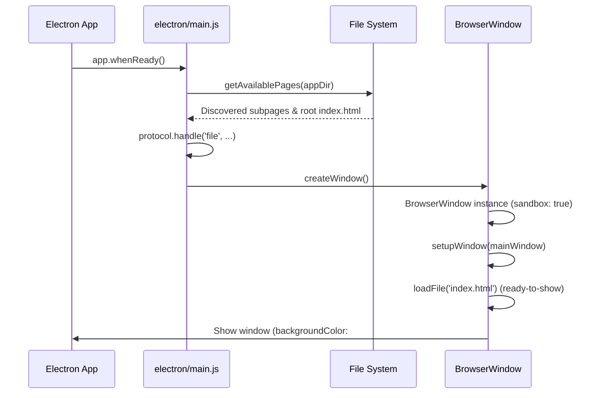

# Electron Desktop Wrapper

The Electron desktop wrapper (`electron/main.js`) provides a native desktop runtime for Oidarwave, packaging the web application into cross-platform desktop installers and executables across Windows, macOS, and Linux.

## Architecture and Entry Point

The Electron main process (`electron/main.js`) initializes the desktop runtime, handles window lifecycle events, manages dynamic page discovery, enforces security sandboxing, and intercepts protocol requests.



## Responsibilities and Core Components

### 1. Dynamic Page Discovery & Routing
To support client-side routing and multi-page discovery within packaged builds (where directory listing APIs might otherwise be restricted or require exact file paths), `electron/main.js` implements a dynamic page discovery engine:
- **`.npmignore` Integration (`getIgnoredDirs`)**: Parses `.npmignore` and combines user-defined ignores with default exclusions (`node_modules`, `.git`, `dist`, `electron`) to filter out build artifacts and development directories during recursive directory scans.
- **`discoverPages`**: Recursively scans the application directory asynchronously using `Promise.all` and `fs.promises.readdir` to identify valid subpage directories containing `index.html`.
- **`matchesRoute` & Protocol Handlers**: Normalizes route paths, file URLs, and custom `oidarwave://` scheme links, ensuring seamless navigation between root and subpages within the desktop app wrapper.

### 2. Secure File Protocol Interception
Electron's default `file://` handling is intercepted via `protocol.handle('file', ...)` to enforce rigorous directory traversal protection:
- Strips query parameters and hash fragments from request URLs before path resolution.
- Resolves absolute file paths using `fileURLToPath` and `path.resolve`.
- Enforces containment under the application root directory (`appDir`), blocking traversal attempts (e.g. `..`) with a `403 Access Denied` response.
- Fetches validated local files securely via `net.fetch(..., { bypassCustomProtocolHandlers: true })`.

### 3. Window Lifecycle & Security Hardening
Each `BrowserWindow` instance is created with strict security defaults and window management handlers:
- **Sandboxing & Isolation**: `nodeIntegration: false`, `contextIsolation: true`, `webSecurity: true`, and `sandbox: true` are explicitly enabled to isolate untrusted content and prevent Node.js API access from renderer processes.
- **Anti-Flash & Styling**: Windows initialize with `show: false` and a matching background color (`backgroundColor: '#0f172a'`, aligning with `--color-bg-base`), showing only upon the `ready-to-show` event to eliminate startup white flashes.
- **External & Internal Navigation Control**:
  - `will-navigate` and `will-redirect` events intercept links: external `http://`/`https://` URLs are opened via `shell.openExternal`, while internal app routes attempt subpage loading or fall back to `index.html`.
  - `setWindowOpenHandler` manages new window creation requests for `file://` or `oidarwave://` links, spinning up isolated secondary `BrowserWindow` instances with identical security parameters.

## Packaging and Build Configuration (`package.json`)

Cross-platform packaging is driven by `electron-builder` configured in `package.json`:
- **App Metadata**: `appId` (`app.oidarwave.vercel`), `productName` (`Oidarwave`), and output directory (`dist`).
- **Files Inclusion**: Explicitly packages necessary runtime assets:
  ```json
  "files": [
    "electron/**/*",
    "src/**/*",
    "index.html",
    "favicon/**/*",
    "manifest.json",
    "video/**/*",
    "impressum/**/*"
  ]
  ```
- **Target Platforms**:
  - **Windows**: NSIS installer (`nsis`) supporting one-click/custom directory installs, desktop shortcuts, and `zip` archives for `x64` and `arm64`.
  - **macOS**: DMG disk images and `zip` bundles categorizing the app under `public.app-category.audio`.
  - **Linux**: AppImage, Debian packages (`deb`), tarballs (`tar.gz`), RPM packages, FreeBSD targets, and Snap packages across `x64` and `arm64`.

## Testing and Verification

Build configuration and packaging invariants are validated by dedicated test suites:
- **`tests/test_electron_build.py`**:
  - Verifies the existence of `electron/main.js`.
  - Validates `package.json` build metadata, required directories, and file inclusion patterns.
  - Confirms that `electron` and `electron-builder` are correctly declared in `devDependencies`.
- **Syntax and Integration Tests**: Tested alongside frontend architecture and general website sanity checks in `tests/test_syntax.py` and `tests/test_website.py`.
