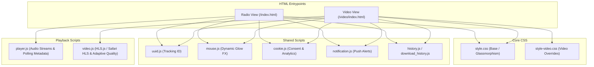

# Frontend Architecture

Oidarwave's web frontend is built as a responsive single-page application (SPA) experience divided into two primary views: **Radio** (`index.html`) and **Video** (`/video/index.html`). It utilizes modern HTML5 semantics, custom CSS styling with glassmorphism design, and modular vanilla JavaScript ES modules/scripts for playback control, live metadata fetching, HLS video adaptation, browser notifications, and local state persistence.

## Overall Architecture & Entrypoints

The frontend architecture separates audio streaming from video streaming while sharing core navigation, styling systems, mouse interaction effects, and cookie consent preferences.

## DOM Layout & HTML Structure

Each page is wrapped in a responsive `.container` layout featuring:
- **Header (`<header>`):** Displays the branding logo (`🎵 Oidarwave`) and navigation links (`<nav>`) pointing between Radio, Video, Contact, and Beta deployments [repo://index.html#L40-L48].
- **Main Player Section (`<main>`):** Implements a two-column grid (`.player-section`) containing:
  1. **Station Selector (`.station-selector`):** A responsive CSS grid (`.station-grid`) of interactive buttons (`.station-btn`) configured via `data-*` attributes (`data-url`, `data-name`, `data-metadata-url`) [repo://index.html#L50-L84].
  2. **Player Controls (`.player-controls`):** Features status indicators (`#statusIndicator`), station name display (`#currentStation`), and native or custom media elements (`<audio>` or `<video>`) [repo://index.html#L86-L103, repo://video/index.html#L77-L87].
- **Footer (`<footer>`):** Copyright notices, dynamic asset badges, and links to Impressum & Data Protection [repo://index.html#L106-L108].
- **Cookie Banner (`.cookie-banner`):** A fixed dialog handling user consent for analytics scripts [repo://index.html#L110-L120].

## CSS Styling & Design System (`style.css`)

The styling architecture uses CSS Custom Properties (`:root`) defined in `src/css/style.css` to establish a cohesive dark-mode aesthetic:
- **Colors & Glassmorphism:** Uses translucent glass backgrounds (`--color-glass-bg: rgba(30, 41, 59, 0.4)`), backdrop filters (`backdrop-filter: blur(24px)`), and subtle borders (`--color-glass-border`) [repo://src/css/style.css#L3-L39].
- **Dynamic Mouse Glow:** `src/js/mouse.js` updates CSS variables `--mouse-x` and `--mouse-y` based on cursor movement, rendering a subtle radial gradient light follow effect on the background [repo://src/css/style.css#L55-L58].
- **Status Indicators:** Color-coded status dots (`.status-indicator`) reflect real-time connection health:
  - `online` (`#10b981`): Stream is actively playing.
  - `buffering` (`#f59e0b`): Stream is stalled or waiting (`waiting` event).
  - `paused` (`#3b82f6`): Playback is paused.
  - `error` (`#ef4444`): Network offline or media error encountered [repo://src/css/style.css#L14-L17, repo://src/js/player.js#L119-L132].

## Client-Side Playback Engines

### 1. Audio Player (`src/js/player.js`)
- **Initialization:** Caches DOM nodes, detects `audioPlayer`, sets default volume to `1`, and restores the last played station from `localStorage` (`lastStationAudioUrl`) [repo://src/js/player.js#L51-L72, L240-L254].
- **Metadata Polling:** For radio stations providing a `data-metadata-url`, `fetchMetadata()` polls text or JSON endpoints every 3 seconds (`METADATA_REFRESH_INTERVAL`), parsing artist and title information to update `#currentSongTitle` and trigger push notifications [repo://src/js/player.js#L3, L195-L229].
- **Media Session API:** Integrates with mobile lock screens and system media keys (`play`, `pause`, `stop`) via `navigator.mediaSession` [repo://src/js/player.js#L5-L40].
- **Keyboard Shortcuts:** Global keydown listeners toggle play/pause (`Space`) and adjust volume (`ArrowUp`/`ArrowDown`) when focus is outside form controls [repo://src/js/player.js#L171-L193].

### 2. Video HLS Player (`src/js/video.js`)
- **HLS.js Integration:** Loads HLS streams (`.m3u8`) via [HLS.js](https://github.com/video-dev/hls.js) with fallback to native Safari HLS (`application/vnd.apple.mpegurl`) [repo://src/js/video.js#L180-L266].
- **Error Recovery & Retries:** Implements an exponential backoff retry mechanism (`MAX_RETRIES = 3`, `RETRY_BASE_DELAY = 1000ms`) for fatal network errors and automatic recovery for media buffer errors [repo://src/js/video.js#L163-L248].
- **Data-Saving Mode:** Toggling datensparmodus (`dataModeToggle`) restricts HLS quality levels (`hlsPlayer.currentLevel = 0` vs `-1` for auto) [repo://src/js/video.js#L132-L136, L277-L281].
- **Closed Captions:** Manages subtitle/caption track visibility based on user preferences stored in `localStorage` [repo://src/js/video.js#L110-L159].

## Supporting Utility Modules

- **Cookie Consent (`src/js/cookie.js`):** Enforces a 90-day consent window (`consentTimestamp`). Acceptance injects Vercel Analytics (`insights/script.js`), Speed Insights, and Google Tag Manager (`gtag.js`) [repo://src/js/cookie.js#L5-L61].
- **Notifications (`src/js/notification.js`):** Requests browser notification permissions and debounces track-change events (2-second delay) to display native push alerts when radio song titles change [repo://src/js/notification.js#L30-L118].
- **Station & Download History (`history.js`, `download_history.js`):** Tracks user listening and download activities in client storage [repo://src/js/player.js#L87, L93].
- **UUID Generation (`uuid.js`):** Assigns persistent anonymous client identifiers.

## State Persistence & Lifecycle

Client preferences are safely persisted via `localStorage` wrapped in `try...catch` blocks to handle storage quota failures or privacy-mode restrictions:
- Last played audio/video station URL (`lastStationAudioUrl`, `lastStationVideoUrl`) [repo://src/js/player.js#L67, L71, L148].
- Cookie consent state and timestamp (`cookieConsent`, `consentTimestamp`) [repo://src/js/cookie.js#L5-L6].
- Notification preferences (`notificationsEnabled`) [repo://src/js/notification.js#L23].
- Video settings (`dataSaveMode`, `captionsEnabled`) [repo://src/js/video.js#L4-L5].
