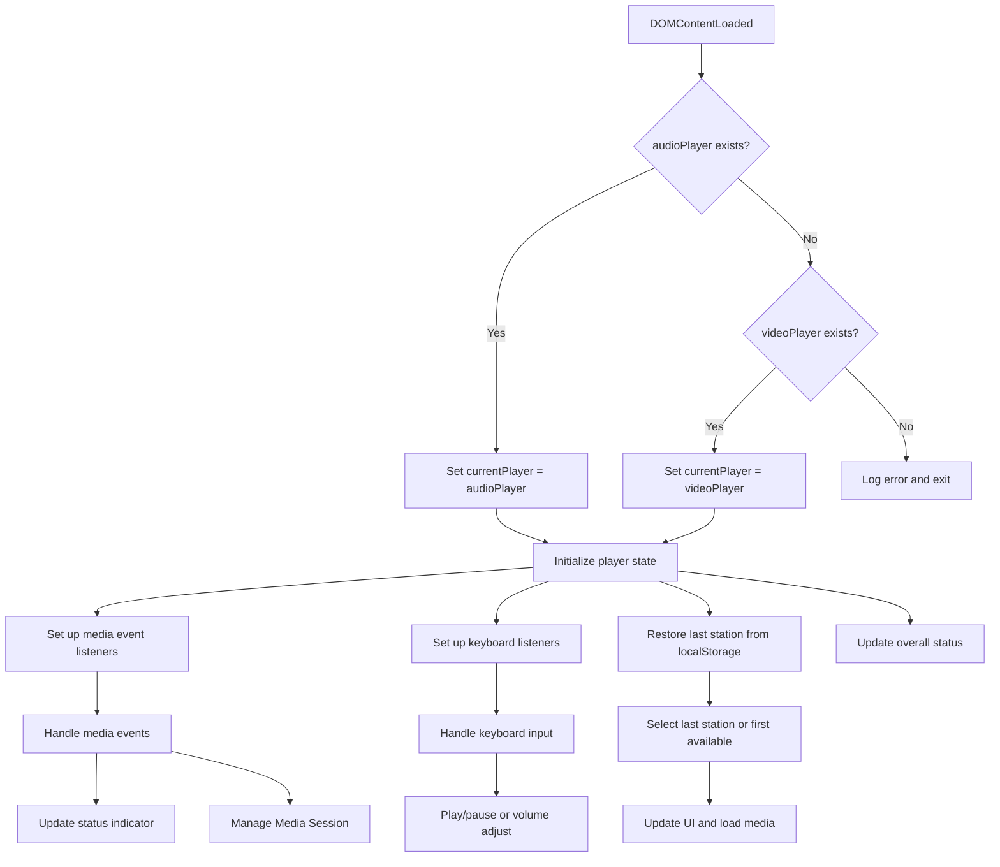

# Player Subsystem

## Purpose

The Player Subsystem manages audio and video playback functionality across the application. It provides unified handling for both audio-only streams (using HTML5 audio elements) and video streams (using HLS.js for adaptive bitrate streaming), with consistent media controls, error handling, and system integration.

## Responsibilities

- Audio playback via HTML5 `<audio>` element
- Video playback via HLS.js with fallback to native HLS support
- Media Session API integration for system-level controls (lock screen, notifications)
- Error detection and recovery mechanisms for both audio and video streams
- Stall/buffering state detection and user feedback
- Metadata fetching and display for current track information
- Persistence of user preferences (last station, volume, captions, data save mode)
- Keyboard navigation and accessibility controls
- Status indicator updates reflecting playback state

## Entrypoints

The subsystem initializes through two primary files:
- `src/js/player.js` - Initializes audio player functionality
- `src/js/video.js` - Initializes video player functionality with HLS support

Both files are invoked via `DOMContentLoaded` event listeners and share common patterns for media handling.

## Mechanisms & Control Flow

### Initialization

1. **Audio Player** (`player.js`):
   - Detects presence of audioPlayer or videoPlayer elements
   - Sets up event listeners for media events (loadstart, canplay, playing, pause, waiting, error)
   - Configures keyboard handlers (space, arrow keys)
   - Restores last played station from localStorage
   - Initializes metadata refresh interval

2. **Video Player** (`video.js`):
   - Sets up HLS.js player instance when HLS is supported
   - Falls back to native HLS in Safari when available
   - Configures caption/text track handling
   - Sets up data save mode and quality selection
   - Initializes event listeners for station buttons, toggles, and keyboard navigation

### Playback Flow

1. **Station Selection**:
   - User clicks station button or system restores last station
   - `selectStation()` (audio) or `setupHlsPlayer()` (video) called
   - Media element source updated and `.load()` called
   - Metadata fetching initiated if available

2. **Media Events**:
   - Audio: Direct HTML5 media events drive state updates
   - Video: HLS.js events (MANIFEST_PARSED, ERROR) manage playback state
   - Both update status indicator and Media Session accordingly

3. **Error Handling**:
   - Audio: Tracks `hasError` flag from media error events
   - Video: Implements retry mechanism with exponential backoff for network errors
   - Both update UI to reflect error state and provide user feedback

### Stall Recovery

- Audio: Uses `waiting` event to detect stalls, `playing` to detect recovery
- Video: HLS.js automatically handles buffer-related errors; fatal errors trigger recovery procedures
- Status indicator shows "buffering" state during stalls

### Media Session Integration

Both players implement:
- `setupMediaSession()`: Configures MediaMetadata and action handlers (play, pause, stop)
- `clearMediaSession()`: Clears metadata when needed
- Metadata updated with track information from fetched metadata
- Handlers delegate to player's play/pause methods

### Persistence

- Last station URL stored in localStorage (`lastStationAudioUrl`/`lastStationVideoUrl`)
- User preferences (volume, captions enabled, data save mode) persisted via localStorage
- Values restored on initialization

## Relationships

### Dependencies
- **HLS.js**: External library for HLS streaming in video.js
- **Media Session API**: Browser API for system media controls
- **localStorage**: For persistence of user preferences and last station
- **StationHistory**: Used in player.js to track station history (referenced but not defined in examined files)
- **notificationManager**: Referenced in player.js for track change notifications

### Integration Points
- **Station Buttons**: DOM elements with data-url, data-name, data-metadata-url attributes
- **Status Indicator**: Element showing playback state (online/error/buffering/paused)
- **Current Station Display**: Element showing current station name
- **Current Song Title Display**: Element showing track information
- **Keyboard Controls**: Global keydown listeners for playback control
- **Visibility Change**: Video player resumes playback when tab becomes visible

## State & Lifecycle

### State Variables
- `hasError`: Boolean indicating error state
- `isStalled`: Boolean indicating buffering state
- `isAudioPlayer`: Flag distinguishing audio vs video player
- `metadataInterval`: Interval ID for metadata refresh
- `currentPlayer`: Reference to active media element
- `lastStationKey`: Storage key for last station URL
- `hlsPlayer`: HLS.js instance (video.js only)
- `retryState`: Tracks retry attempts for HLS errors (video.js only)
- `settingsCache`: Cached user preferences (video.js only)

### Lifecycle
1. **Initialization**: DOMContentLoaded → setup players and event listeners
2. **Station Load**: Source change → load media → fire media events
3. **Playback**: User interaction or autoplay → play() → playing event
4. **Error/Stall**: Media events → update state → UI reflects condition
5. **Cleanup**: Page unload or source change → clear intervals, reset state

## Invariants & Failure Handling

### Invariants
- Only one player (audio or video) active at a time based on available elements
- Media Session metadata reflects current playback content
- Status indicator accurately represents playback state
- Last played station is persistently stored and restored
- Keyboard controls respect input focus (don't interfere with form elements)

### Failure Scenarios
1. **Network Errors**:
   - Audio: Error event sets hasError flag, updates status to error
   - Video: HLS.js network errors trigger retry mechanism with exponential backoff
   - Both show error state in status indicator

2. **Media Errors**:
   - Audio: Handled via media error event
   - Video: HLS.js media errors attempt recovery via recoverMediaError()
   - Fatal errors destroy HLS instance and show persistent error

3. **Stall Conditions**:
   - Detected via waiting event (audio) or HLS.js buffer events (video)
   - Status indicator shows buffering state
   - Automatically resumes when data available

4. **Browser Limitations**:
   - Video.js checks for HLS.js support and native HLS capability
   - Shows user-friendly error when neither is available
   - Audio player degrades gracefully if audio element missing

## Extension Points

1. **Metadata Sources**: fetchMetadata() function can be adapted for different metadata formats
2. **Error Handling**: Error recovery logic centralized in onHlsError handler (video.js)
3. **Quality Selection**: updateQualityLevel() responds to dataSaveMode setting
4. **Caption Management**: Modular functions for enabling/disabling captions
5. **Event Handling**: Consistent patterns for adding listeners with passive options where appropriate
6. **Storage Mechanism**: localStorage wrapper functions allow substitution

## Configuration & Operations

### Configurable Constants
- **METADATA_REFRESH_INTERVAL** (3000ms): How often to fetch updated metadata
- **VOLUME_STEP** (0.1): Volume change per keyboard press
- **VOLUME_PRECISION** (1): Decimal places for volume display
- **SEEK_TIME** (10): Seconds to seek with arrow keys (video.js)
- **MAX_RETRIES** (3): HLS network error retry attempts (video.js)
- **RETRY_BASE_DELAY** (1000ms): Base delay for HLS retry exponential backoff

### Operational Aspects
- **Memory Management**: HLS.js instances properly destroyed on source change
- **Event Cleanup**: Intervals cleared when changing stations
- **Performance**: Uses passive event listeners where safe, for...of loops for efficiency
- **Accessibility**: ARIA-pressed attributes on toggle elements, keyboard navigation
- **Browser Compatibility**: Feature detection for HLS support and Media Session API

## Tests & Validation

### Key Test Scenarios (based on code inspection)
1. **Initialization**:
   - Verify player initializes with correct element (audio/video)
   - Confirm event listeners attached to media element
   - Check last station restoration from localStorage

2. **Station Switching**:
   - Validate source update and load() called
   - Confirm metadata interval reset and restarted
   - Check active station button styling updated

3. **Playback Controls**:
   - Space bar toggles play/pause
   - Arrow keys adjust volume (audio) or seek (video)
   - Media Session handlers invoke correct player methods

4. **Error Handling**:
   - Error events set appropriate state flags
   - Status indicator reflects error condition
   - Video implements retry logic for network errors
   - Media errors trigger recovery where possible

5. **State Persistence**:
   - Last station stored and restored across sessions
   - User preferences (volume, captions, data save) persisted
   - Values correctly applied on initialization

6. **HLS Specific** (video.js):
   - HLS.js instance created when supported
   - Fallback to native HLS in Safari
   - Caption tracks managed according to user preference
   - Quality level adjusted based on data save mode

## Diagrams

### Audio Player Initialization Flow


### Video Player HLS Error Recovery
<!-- openwiki: mermaid parse failed and this diagram was converted to a text fence so it does not break rendering. Fix the diagram source and restore the mermaid fence. Parser error: Heuristic: an unescaped angle bracket inside a label breaks rendering; rephrase the label. -->
```text
flowchart stateDiagram-v2
    [*] --> Idle
    Idle --> Loading: setupHlsPlayer() called
    Loading --> ManifestParsed: HLS.Events.MANIFEST_PARSED
    ManifestParsed --> Playing: video.play() called
    Playing --> Buffering: HLS buffer events
    Buffering --> Playing: Data available
    Playing --> Error: HLS.Events.ERROR
    Error --> NetworkError: data.type == NETWORK_ERROR
    Error --> MediaError: data.type == MEDIA_ERROR
    Error --> FatalError: Other error types
    
    NetworkError --> Retry: retryState.count < MAX_RETRIES
    NetworkError --> Failed: retryState.count >= MAX_RETRIES
    Retry --> DelayedRetry: setTimeout with exponential backoff
    DelayedRetry --> Loading: hlsPlayer.startLoad()
    
    MediaError --> Recovery: hlsPlayer.recoverMediaError()
    Recovery --> Playing: Recovery successful
    Recovery --> Error: Recovery failed
    
    Failed --> [*]: Show persistent error
    FatalError --> [*>: Show error and stop
    
    Playing --> Paused: video.pause() called
    Paused --> Playing: video.play() called
    Playing --> [*]: Page unload or source change
```

## Related Documentation
- [System Overview](/openwiki/architecture/overview.md)
- [Media Session Concepts](/openwiki/concepts/media-session.md)
- [HLS.js Integration Details](/openwiki/integrations/hlsjs.md)
- [Playback Workflows](/openwiki/workflows/playback.md)
