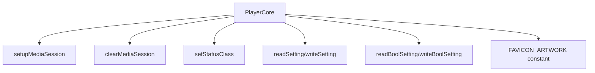
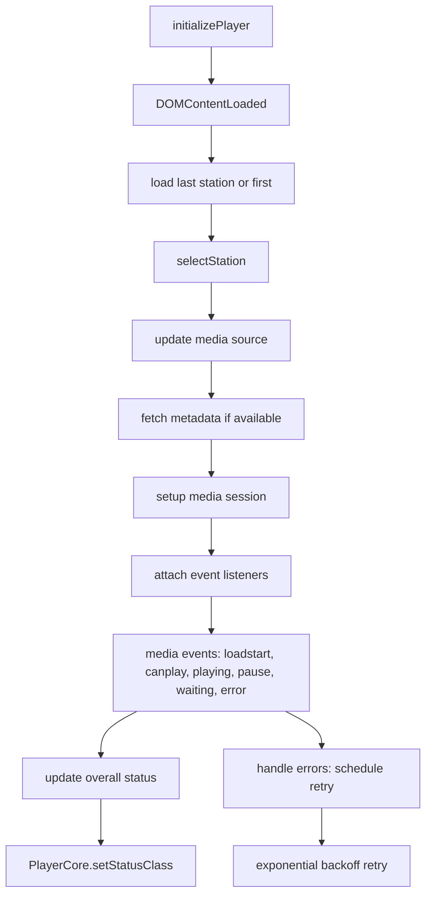
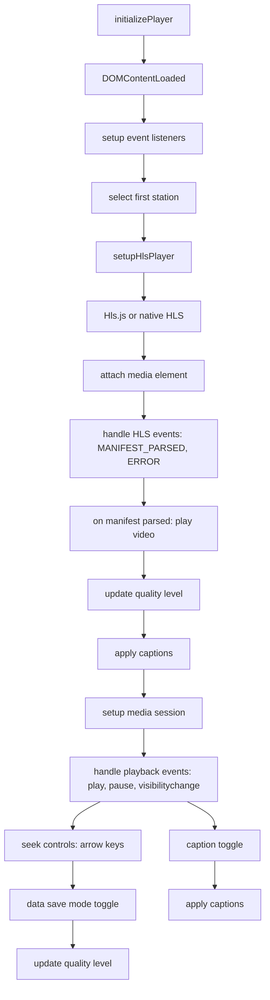

## Overview

The player system consists of a shared core (`PlayerCore`) and two specialized implementations: an audio-only player (`player.js`) and a video player with HLS support (`video.js`). Both players integrate with the Media Session API for system-level controls (lock screen, media notifications) and share common error handling, status indicators, and persistent settings.

## Responsibilities

- **PlayerCore**: Provides deduplicated functionality used by both audio and video players:
  - Media Session API setup and cleanup (`setupMediaSession`, `clearMediaSession`)
  - Status indicator CSS class management (`setStatusClass`)
  - LocalStorage helpers with error handling (`readSetting`, `writeSetting`, `readBoolSetting`, `writeBoolSetting`)
  - Favicon artwork constants for Media Session metadata

- **Audio Player (`player.js`)**:
  - Manages HTML5 `AudioElement` for audio streaming
  - Implements automatic retry logic with exponential backoff for network recovery
  - Handles station selection, metadata fetching, and history tracking
  - Responds to keyboard controls (space for play/pause, arrow keys for volume)

- **Video Player (`video.js`)**:
  - Manages HLS.js for adaptive video streaming with fallback to native Safari HLS
  - Implements data-saving mode, caption/subtitle toggles, and seek controls (arrow keys)
  - Includes quality level adjustment based on data-saving setting
  - Handles HLS-specific error recovery and retry logic

Both players:
- Update Media Session metadata with track information
- Synchronize playback state with online/offline events
- Update status indicators (online, error, buffering, paused)
- Log errors via centralized error handling (`errors.js`)

## Components and Data Flow

### PlayerCore (src/js/player-core.js)

```mermaid
graph TD
    A[PlayerCore] --> B[setupMediaSession]
    A --> C[clearMediaSession]
    A --> D[setStatusClass]
    A --> E[readSetting/writeSetting]
    A --> F[readBoolSetting/writeBoolSetting]
    A --> G[FAVICON_ARTWORK constant]
```

### Audio Player (src/js/player.js)

```mermaid
graph TD
    H[initializePlayer] --> I[DOMContentLoaded]
    I --> J[load last station or first]
    J --> K[selectStation]
    K --> L[update media source]
    L --> M[fetch metadata if available]
    M --> N[setup media session]
    N --> O[attach event listeners]
    O --> P[media events: loadstart, canplay, playing, pause, waiting, error]
    P --> Q[update overall status]
    Q --> R[PlayerCore.setStatusClass]
    P --> S[handle errors: schedule retry]
    S --> T[exponential backoff retry]
```

### Video Player (src/js/video.js)

```mermaid
graph TD
    U[initializePlayer] --> V[DOMContentLoaded]
    V --> W[setup event listeners]
    W --> X[select first station]
    X --> Y[setupHlsPlayer]
    Y --> Z[Hls.js or native HLS]
    Z --> AA[attach media element]
    AA --> AB[handle HLS events: MANIFEST_PARSED, ERROR]
    AB --> AC[on manifest parsed: play video]
    AC --> AD[update quality level]
    AD --> AE[apply captions]
    AE --> AF[setup media session]
    AF --> AG[handle playback events: play, pause, visibilitychange]
    AG --> AH[seek controls: arrow keys]
    AH --> AI[data save mode toggle]
    AI --> AJ[update quality level]
    AG --> AK[caption toggle]
    AK --> AL[apply captions]
```

## Media Session Integration

Both players use the Media Session API through `PlayerCore.setupMediaSession`:
- Sets metadata (title, artist, album, artwork) using station and track information
- Configures action handlers for play, pause, and stop
- Stop handler pauses media and optionally clears the session
- Metadata is updated dynamically when track information changes (audio) or on station change (video)
- Session is cleared on station change, error, or when stopping playback

Evidence:
- `player-core.js`: `setupMediaSession` function (lines 33-51)
- `player.js`: `updateMediaSession` helper and calls in `playing` event and `fetchMetadata` (lines 32, 56, 262)
- `video.js`: `setupMediaSession` call in `selectStation` (lines 267-273)

## Error Handling and Recovery

### Audio Player Recovery
- Network errors trigger exponential backoff retry (max 3 attempts)
- Offline events pause retry timers; online events trigger immediate retry if applicable
- Errors logged via `logError` with context (src, retry count)
- Status indicator shows retry progress and final error state

Evidence:
- `player.js`: `scheduleAudioRetry`, `retryAudio`, `clearAudioRetry` (lines 144-176)
- `player.js`: Online/offline event handlers (lines 94-116)
- `errors.js`: Error codes `AUDIO_RECONNECT_RETRY`, `AUDIO_RECONNECT_FAILED` (lines 55-56)

### Video Player Recovery
- HLS.js network errors trigger exponential backoff retry (max 3 attempts)
- Fatal errors destroy HLS instance and require manual reload
- Non-fatal media errors attempt automatic recovery via `hlsPlayer.recoverMediaError()`
- Errors logged via `logError` with HLS-specific context
- Status messages shown for network failures and unsupported formats

Evidence:
- `video.js`: `handleNetworkRetry`, `handleFatalHlsError`, `onHlsError` (lines 178-226)
- `video.js`: Retry state management in `setupHlsPlayer` (lines 132-137)
- `errors.js`: Error codes `HLS_NETWORK`, `HLS_MEDIA`, `HLS_FATAL` (lines 43-45)

## State and Lifecycle

### Audio Player State
- `hasError`: Tracks sticky error state
- `isStalled`: Tracks buffering state
- `wasPlayingBeforeError`: Tracks if playback was active before error
- `isAutoRetry`: Distinguishes user-initiated vs automatic retries
- `retryState`: Tracks retry count and timer ID

### Video Player State
- `hlsPlayer`: HLS.js instance or null
- `retryState`: Tracks HLS retry count and timer ID
- `settingsCache`: Cached values for data-saving mode and caption state
- `statusMessageTimeout`: For temporary status messages

Lifecycle:
1. DOMContentLoaded initializes player
2. Station selection sets media source and starts playback
3. Media events update state and UI
4. Errors trigger recovery mechanisms
5. Online/offline and visibility events adjust behavior
6. Station change clears current state and loads new source

## Configuration

### Persistent Settings (LocalStorage)
- Audio player: `lastStationAudioUrl` - remembers last selected station
- Video player: 
  - `dataSaveMode`: Boolean, reduces video quality to save data
  - `captionsEnabled`: Boolean, controls subtitle display

### Constants
- Audio: `METADATA_REFRESH_INTERVAL` (3000ms), `VOLUME_STEP` (0.1), `MAX_RETRIES` (3)
- Video: `SEEK_TIME` (10 seconds), `MAX_RETRIES` (3), `RETRY_BASE_DELAY` (1000ms)
- Shared: `VOLUME_PRECISION` (1 decimal place)

## Extension Points

1. **Metadata Sources**: Audio player's `fetchMetadata` function can be adapted for different metadata formats by modifying the response handling in lines 240-243 of `player.js`.

2. **HLS Configuration**: Video player's Hls.js instantiation (lines 143-147) allows custom configuration via the `Hls` constructor options.

3. **Media Session Metadata**: Both players construct metadata differently:
   - Audio: Uses station name as album, track title/artist from metadata
   - Video: Uses station name as title, fixed artist/album
   To change metadata mapping, modify the `updateMediaSession` call parameters.

4. **Error Handling**: Custom error handling can be added by extending the `ErrorCode` enum in `errors.js` and adding corresponding log handlers.

## Related Concepts and Workflows

- **Media Session**: See /openwiki/concepts/media-session.md for details on system-level media controls.
- **Error Handling**: See /openwiki/workflows/error-handling.md for centralized error logging mechanisms.
- **Playback Workflow**: See /openwiki/workflows/playback.md for detailed playback control sequences.

## Tests and Verification

While no explicit test files were found in the seed paths, the implementation includes:
- Defensive null checks for DOM elements
- Try/catch blocks for LocalStorage and Media Session API
- Explicit event listener cleanup in video player (HLS destruction)
- State validation before retry attempts (e.g., `wasPlayingBeforeError` check)
- Fallback mechanisms (native HLS when Hls.js unsupported)
