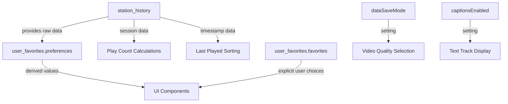

# LocalStorage Data Model

This document provides a detailed specification of the localStorage data model used by the application. It defines all storage keys, their data formats, validation rules, and relationships between different data entities.

## Overview

The application uses localStorage to persist user data across sessions, including:
- Cookie consent preferences
- Station playback history
- User favorites and derived preferences
- Media playback settings (data-save mode, captions)

Each module manages its own storage keys with explicit naming to prevent collisions and implements error handling for quota exceeded or security errors.

## Storage Keys Reference

| Key | Purpose | Data Type | Module |
|-----|---------|-----------|--------|
| `cookieConsent` | User consent status for tracking | String (`'true'`\|`'false'`) | cookie.js |
| `consentTimestamp` | Timestamp of consent decision | Number (milliseconds since epoch) | cookie.js |
| `station_history` | Complete station playback history | Object (see History Structure) | history.js |
| `user_favorites` | User favorites and preferences | Object (see Favorites Structure) | favorite.js |
| `dataSaveMode` | Bandwidth-saving mode toggle | String (`'true'`\|`'false'`) | video.js |
| `captionsEnabled` | Caption/subtitle display preference | String (`'true'`\|`'false'`) | video.js |

## Detailed Data Structures

### Cookie Consent

Stores user preferences for tracking scripts with automatic expiration.

**Structure:**
- `cookieConsent`: `'true'` (accepted) or `'false'` (declined)
- `consentTimestamp`: Milliseconds since Unix epoch when consent was recorded

**Expiration:** Consent data is automatically removed if older than 90 days.

### Station History

Tracks playback sessions for each radio station with session-level granularity.

**Structure:**
```javascript
{
  stations: {
    [stationId]: {
      url: string,           // Station stream URL
      name: string,          // Station display name
      sessions: Array<{      // Playback sessions
        start: number,       // Session start timestamp (ms since epoch)
        end: number|null     // Session end timestamp (null for active sessions)
      }>,
      favicon: string|null   // Station favicon URL
    }
  },
  activeStationUrl: string|null,  // Currently playing station URL
  version: number              // Schema version (currently 1)
}
```

**Key Features:**
- UUID-based station identification (migrated from legacy URL-keyed format)
- Session tracking with precise start/end timestamps
- Automatic pruning of sessions older than 90 days
- Active station detection
- Derived metrics: play count, total duration, last played timestamp

### Favorites and Preferences

Manages user bookmarked stations and derives preferences from playback history.

**Structure:**
```javascript
{
  version: number,                           // Schema version (currently 1)
  favorites: Array<{                         // User bookmarked stations
    id: string (UUID),                       // Unique favorite identifier
    name: string,                            // Favorite display name
    url: string|null,                        // Station URL (if applicable)
    data: object,                            // Arbitrary metadata
    addedAt: number                          // Timestamp when added (ms since epoch)
  }>,
  preferences: {                             // Derived preferences from history
    favoriteStation: string|null,            // Most played station URL
    favoriteStationName: string|null,        // Most played station name
    lastPlayedStation: string|null,          // Recently played station URL
    lastPlayedStationName: string|null,      // Recently played station name
    totalPlayCount: number,                  // Aggregate play count across all stations
    totalStations: number,                   // Number of unique stations played
    lastUpdated: number                      // Timestamp of last preference update (ms since epoch)
  }
}
```

**Key Features:**
- UUID-based favorite identification (migrated from legacy URL-based format)
- URL deduplication to prevent duplicate favorites for the same station
- Preferences automatically derived from station history
- Direct preference setting via API for manual overrides
- Cache invalidation when underlying history changes

### Video Settings

Stores user preferences for media playback behavior.

**Structure:**
- `dataSaveMode`: `'true'` (enabled) or `'false'` (disabled)
- `captionsEnabled`: `'true'` (enabled) or `'false'` (disabled)

**Behavior:**
- Boolean values stored as strings for consistency with localStorage API
- Settings automatically applied to media elements during initialization
- Synchronized with UI toggle elements via ARIA attributes
- New text tracks automatically disabled when captions are disabled

## Migration Strategies

Both favorites and history modules include automatic migration from legacy formats:

### Favorites Migration
- **Legacy:** Array of objects with `id` as station URL
- **Current:** UUID-based objects with separate `url` field
- **Process:** `migrateOldFavorites()` converts legacy format on first access

### History Migration
- **Legacy:** Object with station URLs as keys
- **Current:** Object with UUID keys, each containing `url` and `name` fields
- **Process:** `migrateOldHistory()` converts legacy format on first access

## Expiration Policies

| Data Type | Expiration Policy | Implementation |
|-----------|-------------------|----------------|
| Cookie Consent | 90 days | `checkConsentExpiry()` removes old data |
| Station History | 90 days (sessions only) | `pruneHistory()` removes expired sessions |
| Favorites | None (user-controlled) | Manual removal only |
| Preferences | None (derived from history) | Refreshed from history on demand |
| Video Settings | None (user-controlled) | Manual toggle only |

## Access Patterns and Lifecycle

### Initialization Sequence
1. **Cookie Consent:** Checked immediately on load to show/hide consent banner
2. **Station History:** Loaded and pruned of expired data during initialization
3. **Favorites:** Loaded and preference caches populated from history
4. **Video Settings:** Read and applied to media elements

### Runtime Updates
- All write operations go through module-specific setter functions
- Setter functions include error handling for quota exceeded scenarios
- Read operations include fallback defaults for missing or corrupted data
- Cache invalidation mechanisms prevent stale data usage

### Error Handling
- All localStorage access wrapped in try/catch blocks
- Errors logged to console but don't break application functionality
- Graceful degradation to memory-only operation when storage unavailable
- Default values provided for all data types when storage access fails

## Relationships Between Data Entities



## Validation and Integrity

### Type Safety
- All stored values undergo type checking upon retrieval
- Default values provided for type mismatches
- UUID validation for favorite and station identifiers
- Timestamp validation for expiration logic

### Schema Versioning
- Each storage entity includes a version field
- Migration scripts handle version upgrades
- Backward compatibility maintained for one version cycle

### Concurrency Safety
- Single-threaded browser environment prevents concurrent write conflicts
- Last-write-wins policy for tab-to-tab synchronization
- Storage events could be implemented for cross-tab coordination (not currently used)

## Performance Considerations

### Read Optimization
- Frequently accessed data cached in module variables
- Cache invalidation on known write operations
- Expensive computations (like preference derivation) memoized

### Write Optimization
- Batch writes where possible (single JSON.stringify per update)
- Debounced writes for rapidly changing data (not currently implemented)
- Minimal storage footprint through efficient data structures

### Size Management
- Automatic pruning prevents unbounded growth
- Favorites limited by user behavior (no hard limit)
- Video settings constant size (two boolean flags)
- Typical usage remains well under localStorage limits (5MB)
