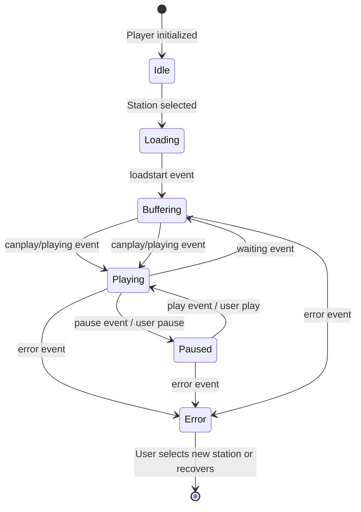

---
type: workflow
title: Playback Workflow
description: Describes the initialization, stream loading, and state handling (playing, paused, stalled, error) for audio and video playback in the application.
tags: [playback, media, player, state-machine]
#

## Overview

The playback workflow manages the lifecycle of media playback for both audio and video streams. It handles player initialization, stream loading, transitions between playing, paused, stalled, and error states, and integrates with the Media Session API for system controls.

## Initialization

When the DOM is loaded, `initializePlayer()` is invoked (see [player.js](repo://src/js/player.js)). This function:

1. Sets up the Media Session API for lock screen and system controls.
2. Initializes state variables (`hasError`, `isStalled`, `isAudioPlayer`, `metadataInterval`, `currentPlayer`, `lastStationKey`).
3. Caches references to DOM elements (player, buttons, displays).
4. Determines whether to use the audio or video player based on availability.
5. Attaches event listeners for media events (`loadstart`, `canplay`, `playing`, `pause`, `waiting`, `error`) and station buttons.
6. Restores the last played station from `localStorage` or starts with the first station.
7. Calls `updateOverallStatus()` to set the initial UI state.

## Stream Loading

Selecting a station triggers `selectStation(button)` (see [player.js#L138-L169]):

1. Updates UI: marks the button as active, updates the current station display.
2. Persists the selected station URL to `localStorage`.
3. Stops any existing metadata polling interval and clears the Media Session.
4. If a metadata URL is provided, initiates an immediate fetch and sets up periodic polling (every 3 seconds) via `fetchMetadata()`.
5. Sets the player's `src` attribute to the station URL and calls `load()` to begin loading the stream.

## Media Event Handling

The workflow responds to HTMLMediaElement events to track playback state:

| Event | Handler Action |
|-------|----------------|
| `loadstart` | Resets `isStalled` flag and updates status. |
| `canplay` | For audio players, attempts to play if paused; resets error and stall flags; updates status. |
| `playing` | Resets stall and error flags; updates status; logs station start in history; configures Media Session with current station name. |
| `pause` | Updates status; logs station stop in history. |
| `waiting` | Sets `isStalled` flag to true and updates status (indicates buffering). |
| `error` | Logs error, sets `hasError` flag, updates status, logs station stop. |

## State Updates

`updateOverallStatus()` (see [player.js#L119-L132]) synchronizes the UI with internal state:

- If offline or `hasError` is true → shows **error** state.
- Else if player is paused → shows **paused** state.
- Else if `isStalled` is true → shows **buffering** state.
- Otherwise → shows **online** state.

## Playback Control

- `playMedia()` (see [player.js#L134-L136]) attempts to play the current media, catching autoplay restriction errors.
- Keyboard shortcuts:
  - Space: toggles play/pause.
  - ArrowUp/ArrowDown: adjust volume for audio players (see [player.js#L171-L193]).

## Metadata Polling

<!-- openwiki: broken internal link [/openwiki/workflows/metadata-polling.md] file "/openwiki/workflows/metadata-polling.md" does not exist. Fix the href or restore the target, then delete this comment. -->
When a station with a metadata URL is selected, `fetchMetadata()` is called immediately and then at intervals defined by `METADATA_REFRESH_INTERVAL` (3000 ms). This workflow is detailed in the [metadata-polling workflow](/openwiki/workflows/metadata-polling.md).

## Error and Stalled States

- **Error**: Triggered by the `error` event; sets `hasError`, stops station history, and updates UI to error state.
- **Stalled**: Triggered by the `waiting` event; sets `isStalled`, updates UI to buffering state. Resolved when `canplay` or `playing` events occur.

## Media Session Integration

The Media Session API is configured via `setupMediaSession()` (see [player.js#L6-L33] and [video.js#L9-L31]) to display media metadata and handle play/pause/stop actions from system controls (e.g., lock screen, headsets). Metadata is updated whenever track information changes via metadata polling.

## Relationships

- Depends on [station-selection workflow](/openwiki/workflows/station-selection.md) for UI interactions that trigger stream changes.
<!-- openwiki: broken internal link [/openwiki/workflows/metadata-polling.md] file "/openwiki/workflows/metadata-polling.md" does not exist. Fix the href or restore the target, then delete this comment. -->
- Drives [metadata-polling workflow](/openwiki/workflows/metadata-polling.md) by starting/stopping intervals based on station metadata availability.
<!-- openwiki: broken internal link [/openwiki/workflows/history.md] file "/openwiki/workflows/history.md" does not exist. Fix the href or restore the target, then delete this comment. -->
- Interacts with [history.js](/openwiki/workflows/history.md) via `StationHistory` to log station starts and stops.

## State Diagram

The following state machine summarizes playback state transitions:

*Note: The Idle state represents a prepared player with no active stream. Loading begins when a station URL is set.*

## Extension Points

- Custom metadata parsers can be integrated by modifying `getMusicInfoWithArtist()` in `player.js`.
- Additional media session actions (e.g., seek, skip) can be added by extending the `setActionHandler` calls in `setupMediaSession()`.
- The status indicator logic in `updateOverallStatus()` can be extended to support additional states (e.g., disconnected, reconnecting).

## Configuration

- Metadata refresh interval: `METADATA_REFRESH_INTERVAL` (3000 ms) in `player.js`.
- Volume step: `VOLUME_STEP` (0.1) and precision: `VOLUME_PRECISION` (1) in `player.js`.
- Video-specific settings (data save mode, captions) are managed in `video.js` via `localStorage`.

## Testing Considerations

- Verify that selecting a station updates the player source and triggers metadata fetching.
- Confirm that play/pause via UI, keyboard, and media session controls correctly transition states and update the UI.
- Simulate network errors and stall conditions to ensure error and buffering states are displayed correctly.
- Test that the last played station is restored on page load when `localStorage` is available.
