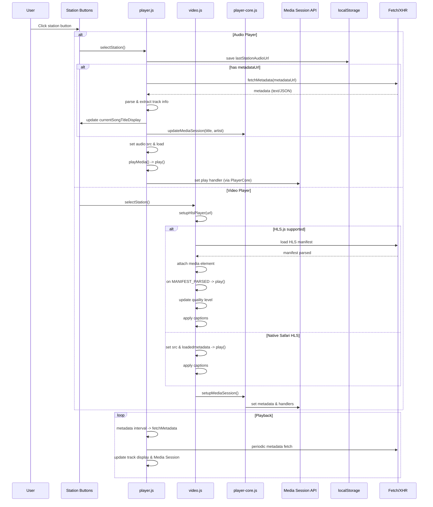

## Overview

The playback workflow encompasses the entire process from user interaction with station controls to continuous media playback with metadata updates and system integration. This workflow applies to both audio-only (`player.js`) and video (`video.js`) players, which share common functionality via `PlayerCore` (`player-core.js`).

## Station Selection

### Entry Point
- User clicks a station button in the UI (`.station-btn` elements in `index.html`)
- Each button contains `data-url`, `data-name`, and optionally `data-metadata-url` attributes

### Audio Player Flow (`player.js`)
1. `selectStation(button)` called via click event listener
2. Clear any existing retry state (`clearAudioRetry()`)
3. Update UI:
   - Remove `active` class from all station buttons
   - Add `active` class to clicked button
   - Update `currentStation` display with station name
4. Persist selection:
   - Save station URL to localStorage (`lastStationAudioUrl` key)
5. Metadata handling:
   - Clear existing metadata refresh interval
   - Clear Media Session state
   - If `metadataUrl` present:
     - Immediately fetch metadata via `fetchMetadata(metadataUrl)`
     - Set up recurring interval (`METADATA_REFRESH_INTERVAL = 3000ms`)
   - Else: show "Metadaten nicht verfügbar" in song title display
6. Load media:
   - Set `audioPlayer.src` to station URL
   - Call `audioPlayer.load()`

### Video Player Flow (`video.js`)
1. `selectStation(button)` called via click event listener
2. Clear status messages
3. Update `currentStation` display with station name
4. Initialize HLS playback via `setupHlsPlayer(button.dataset.url)`
5. Configure Media Session:
   - Title: station name
   - Artist: 'Livestream'
   - Album: 'Oidarwave Video'
   - Media element: video player
   - Stop handler: `clearMediaSession`

## Media Loading and Playback Initiation

### Audio Player
- **Loadstart**: Reset stalled flag, update status indicator
- **Canplay**: 
  - If paused, call `playMedia()` (attempts playback via `currentPlayer.play()`)
  - Reset error and retry states
  - Update status indicator
- **Playing**:
  - Mark as not stalled and error-free
  - Start station history tracking
  - Update Media Session with empty metadata (will be updated when metadata arrives)
- **User interaction**:
  - Space bar: toggle play/pause
  - Arrow keys: adjust volume (with precision to 1 decimal place)

### Video Player
- **HLS.js path** (`window.Hls.isSupported()`):
  1. Configure XHR (no credentials for CORS)
  2. Create Hls instance, load source, attach media element
  3. On `MANIFEST_PARSED`:
     - Clear status messages
     - Attempt playback (`videoPlayer.play()`)
     - Update quality level based on data-saving setting
     - Apply caption settings
- **Native Safari HLS**:
  1. Remove crossorigin attribute (avoids CORS issues)
  2. Set video source directly
  3. On `loadedmetadata`:
     - Clear status messages
     - Attempt playback
     - Apply caption settings
- **Fallback**: Show error if HLS not supported

## Metadata Handling

### Audio Player Metadata Flow
1. `fetchMetadata(metadataUrl)`:
   - Fetch resource from URL
   - Parse as text (`.txt`) or JSON based on extension
   - Extract track information:
     - Text: first line as title
     - JSON: uses `getMusicInfoWithArtist()` to extract `song_now_title`/`playlistItem.title` and artist fields
   - Format display text as "title - artist" or fallback values
2. Update UI:
   - Set `currentSongTitleDisplay` text
   - Trigger notification manager for track change (if available)
3. Update Media Session:
   - Call `updateMediaSession(title, artist)` via `PlayerCore`
   - Uses favicon artwork from `PlayerCore.FAVICON_ARTWORK`
4. Error handling:
   - On fetch/parse errors: show "Metadaten nicht verfügbar", clear Media Session
   - Log errors via centralized error handling (`errors.js`)

### Video Player Metadata
- Video player does not implement external metadata fetching for tracks
- Media Session initialized with static station information (see Station Selection)
- Captions/subtitles handled via HLS.js or native text tracks

## Playback Controls

### Common Controls (Both Players)
- **Media Session API** (via `PlayerCore`):
  - Play action: triggers `play()` on media element
  - Pause action: triggers `pause()` on media element
  - Stop action: pauses media and executes `onStop` callback (clears Media Session)
  - Metadata: dynamically updated with current track/station information
- **Keyboard Shortcuts**:
  - Audio: Space (play/pause), ArrowUp/Down (volume)
  - Video: ArrowLeft/Right (seek ±10 seconds)
- **Status Indicators**:
  - CSS classes managed via `PlayerCore.setStatusClass()`: `online`, `error`, `buffering`, `paused`, `text`
  - Text messages shown for retry attempts and connection issues

### Audio-Specific Controls
- Volume persistence: stored implicitly via HTMLAudioElement volume property
- Automatic retry on network errors (exponential backoff)

### Video-Specific Controls
- **Data Save Mode**: toggles HLS quality level (0 for lowest, -1 for auto)
- **Caption/Subtitle Toggle**:
  - Persists setting via localStorage (`captionsEnabled` key)
  - Applies to HLS.js (`subtitleDisplay`) and native text tracks (`track.mode`)
  - New tracks automatically disabled if captions off
- **Seek Controls**: 
  - ArrowLeft/Right: seek ±10 seconds
  - Implemented via direct `videoPlayer.currentTime` manipulation

## Error Handling and Recovery

### Audio Player Recovery
- **Error Detection**: via HTMLMediaElement `error` event
- **Retry Logic**:
  - Clear retry state on user-initiated station change or playback
  - Schedule retry with exponential backoff (`RETRY_BASE_DELAY = 1000ms`, max `MAX_RETRIES = 3`)
  - On `online` event: immediate retry if was playing before error
  - Max retries exceeded: show "Verbindung verloren – erneut versuchen"
- **State Tracking**:
  - `hasError`: true when media error occurs
  - `wasPlayingBeforeError`: tracks if playback was active before error
  - `isAutoRetry`: distinguishes user vs automatic retry attempts

### Video Player Recovery
- **HLS.js Errors**:
  - Network errors: exponential backoff retry (same parameters as audio)
  - Media errors: attempt automatic recovery via `hlsPlayer.recoverMediaError()`
  - Fatal errors: destroy HLS instance, require manual reload
- **Native HLS Errors**: handled via standard media element events
- **Status Updates**: 
  - Show transient messages via `showStatusMessage()` (auto-clears after duration)
  - Persistent error state shown in status indicator

## Integration with System and Device Features

### Visibility and Lifecycle
- **Page Visibility**:
  - On `visibilitychange` to visible: attempt playback if not paused
  - Stops station history when hidden/backgrounded
- **Online/Offline Events**:
  - `offline`: pause retry timers (preserve retry count)
  - `online`: trigger immediate retry if conditions met (was playing before error, has error, online)
- **Media Session**:
  - Enables lock screen controls (play/pause/stop)
  - Shows metadata on Android/iOS now-playing interfaces
  - Artwork sourced from favicon constants
- **Notifications**:
  - Audio player integrates with `window.notificationManager` for track change alerts
  - Requires user permission (handled elsewhere)

### Workflow Summary

```mermaid
sequenceDiagram
    participant User
    participant UI as Station Buttons
    participant AudioPlayer as player.js
    participant VideoPlayer as video.js
    participant PlayerCore as player-core.js
    participant MediaSession as Media Session API
    participant Storage as localStorage
    participant Network as Fetch/XHR

    User->>UI: Click station button
    alt Audio Player
        UI->>AudioPlayer: selectStation()
        AudioPlayer->>Storage: save lastStationAudioUrl
        alt has metadataUrl
            AudioPlayer->>Network: fetchMetadata(metadataUrl)
            Network-->>AudioPlayer: metadata (text/JSON)
            AudioPlayer->>AudioPlayer: parse & extract track info
            AudioPlayer->>UI: update currentSongTitleDisplay
            AudioPlayer->>PlayerCore: updateMediaSession(title, artist)
        end
        AudioPlayer->>AudioPlayer: set audio src & load
        AudioPlayer->>AudioPlayer: playMedia() -> play()
        AudioPlayer->>MediaSession: set play handler (via PlayerCore)
    else Video Player
        UI->>VideoPlayer: selectStation()
        VideoPlayer->>VideoPlayer: setupHlsPlayer(url)
        alt HLS.js supported
            VideoPlayer->>Network: load HLS manifest
            Network-->>VideoPlayer: manifest parsed
            VideoPlayer->>VideoPlayer: attach media element
            VideoPlayer->>VideoPlayer: on MANIFEST_PARSED -> play()
            VideoPlayer->>VideoPlayer: update quality level
            VideoPlayer->>VideoPlayer: apply captions
        else Native Safari HLS
            VideoPlayer->>VideoPlayer: set src & loadedmetadata -> play()
            VideoPlayer->>VideoPlayer: apply captions
        end
        VideoPlayer->>PlayerCore: setupMediaSession()
        PlayerCore->>MediaSession: set metadata & handlers
    end
    
    loop Playback
        AudioPlayer->>AudioPlayer: metadata interval -> fetchMetadata
        AudioPlayer->>Network: periodic metadata fetch
        AudioPlayer->>AudioPlayer: update track display & Media Session
    end
```
