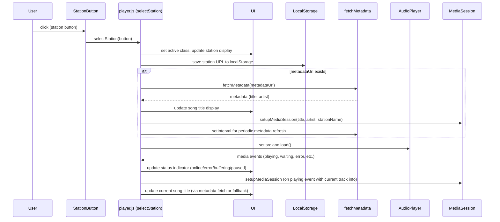

## Overview

When a user clicks a station button in the station grid, the `selectStation` function in `player.js` is invoked. This function updates the UI to reflect the selected station, persists the choice to `localStorage`, configures metadata fetching (if available), and updates the audio player's source. Media events from the player then update the UI and media session accordingly.

## Detailed Flow

The following sequence diagram illustrates the core interactions:

### Step-by-Step Explanation

1. **User Interaction**  
   The user clicks a `<button class="station-btn">` element in the station grid (see `index.html` lines 54-83). Each button carries `data-url`, `data-name`, and optionally `data-metadata-url` attributes.

2. **Event Handling**  
   The click listener attached in `initializePlayer` (see `player.js` lines 108-110) invokes `selectStation(button)` with the clicked button as argument.

3. **UI Update**  
   - All station buttons lose the `active` class; the clicked button gains it (lines 141-142).  
   - The `#currentStation` element's text content is set to the button's `data-name` (line 145).

4. **Persistence**  
   The station's URL is saved to `localStorage` under the key `lastStationAudioUrl` or `lastStationVideoUrl` (lines 148-151), enabling restoration on subsequent loads.

5. **Metadata Setup**  
   - Any existing metadata fetch interval is cleared (lines 153-156).  
   - If the button provides a `data-metadata-url`, `fetchMetadata` is called immediately (line 161) and then scheduled at `METADATA_REFRESH_INTERVAL` (3000ms) intervals (line 162).  
   - If no metadata URL is available, the song title display is set to "Metadaten nicht verfügbar" (lines 163-165).  
   - The media session is cleared before potential re‑setup (line 158).

6. **Player Configuration**  
   - The audio player's `src` property is set to the station's URL (line 167).  
   - `load()` is called to begin loading the new media resource (line 168).

7. **Media Event Handling**  
   The audio player emits standard media events (see `mediaEvents` object, lines 75-102):  
   - `playing`: triggers `updateOverallStatus`, starts station history, and invokes `setupMediaSession` with the current station name (lines 83-89).  
   - `waiting` / `canplay` / `error`: update the status indicator via `updateOverallStatus` (lines 76-82, 95-100).  
   - `pause`: stops station history and updates status (lines 91-94).  

8. **Metadata Fetching** (asynchronous)  
   - `fetchMetadata` retrieves data from the provided URL (lines 195-228).  
   - Depending on the response format (`.txt` or JSON), it extracts `title` and `artist`.  
   - The `#currentSongTitle` element is updated with the formatted track information (lines 212-214).  
   - If a `notificationManager` is present, it handles track change notifications (lines 217-219).  
   - The media session is updated with the current track's title and artist (lines 221-222).  

9. **Error Handling**  
   Metadata fetch errors result in the song title displaying "Metadaten nicht verfügbar" and the media session being cleared (lines 224-228).  
   Media errors set `hasError = true`, prompting the status indicator to show an error state (lines 96-100).

## Invariants and Failure Handling

- **Active Button State**: Exactly one station button retains the `active` class at any time.  
- **LocalStorage Consistency**: The persisted URL (`lastStationAudioUrl`/`lastStationVideoUrl`) always matches the currently selected station's URL, unless cleared externally.  
- **Metadata Interval**: Only one metadata fetch interval runs at a time; it is cleared before setting a new one.  
- **Media Session**: The media session is cleared whenever metadata fetching begins or ends unsuccessfully, and (re)initialized on `playing` events with the latest track and station info.  
- **Offline Recovery**: The `offline` window event stops station history and updates the status indicator to reflect connectivity loss (lines 112-115).  

## Extension Points

- **Custom Metadata Parsers**: The `getMusicInfoWithArtist` function (lines 231-235) can be adapted to handle additional metadata formats by extending the conditional in `fetchMetadata` (lines 199-201).  
- **UI Hooks**: The `currentStationDisplay`, `currentSongTitleDisplay`, and `statusIndicator` elements are openly referenced, allowing other scripts to react to changes.  
- **Notification Integration**: The `window.notificationManager.handleTrackChange` call (lines 217-219) provides a plug‑in point for desktop or push notifications.  

## Related Workflows

- [[playback.md]]: Details the audio playback lifecycle after a station is selected.  
- [[architecture/player.md]]: Describes the overall structure of the player module.  
- [[architecture/ui.md]]: Explains how UI elements are managed and updated.
